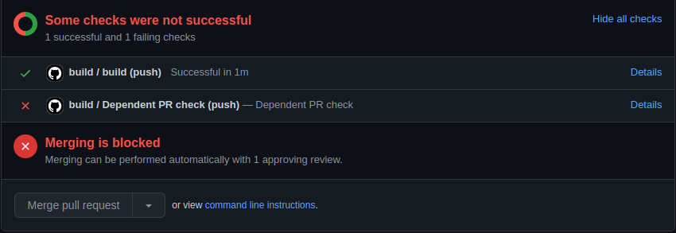

# Dependent PR action

Checks if the current PR depends on another PR and fails if dependent PR has yet to be merged

## Usage

In depending PR add a workflow similar to the following:

```yml
name: pr-dependencies

on:
  push:

jobs:
  pr-dependencies:
    runs-on: ubuntu-latest
    steps:
    - name: Check dependent PR №42
      uses: EduardSergeev/dependent-pr-action@v1
      env:
        GITHUB_TOKEN: ${{ secrets.GITHUB_TOKEN }}
      with:
        dependent-pr: 42

```

This workflow will fail if `PR #42` has yet to be merged thus preveting the depending PR from being merged due to:


