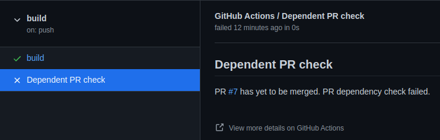

# Dependent PR action

Checks if specified dependent PR has yet to be merged and fails Github check if it has thus preventing the current PR from being merged before dependent PR.

## Usage

In the current PR Github workflow add a step in the following format:

```yml
    - name: Check dependent PR 7
      uses: EduardSergeev/dependent-pr-action@v2
      env:
        GITHUB_TOKEN: ${{ secrets.GITHUB_TOKEN }}
      with:
        dependent-pr: 7
```

This workflow will fail if `PR #7` has yet to be merged thus preveting the depending PR from being merged due to:


Clicking on `Details` provides additional nformation:



## Parameters

- `dependent-pr`: (required) number of the PR which the current PR depends on
- `GITHUB_TOKEN`: (required for private repo) Can be omitted for public repo which does not require Github API authentication

## Example of entire workflow

```yml
name: pr-dependencies

on:
  push:

jobs:
  pr-dependencies:
    runs-on: ubuntu-latest
    steps:
    - name: Check dependent PR №42
      uses: EduardSergeev/dependent-pr-action@v2
      env:
        GITHUB_TOKEN: ${{ secrets.GITHUB_TOKEN }}
      with:
        dependent-pr: 42
```
